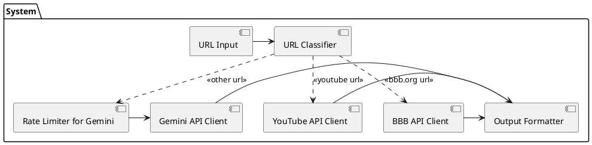

# Gemini webscrapper

It`s required to extract info from BBB, YouTube and unstructured US news sites.

[Example](/benchmark.md)

## Setup

Add `GEMINI_API_KEY` and `YOUTUBE_API_KEY` to /.env file.

## Run benchmark

It is required to launch program with USA IP address.

```bash
go mod tidy
go run .
```

## Architecture



