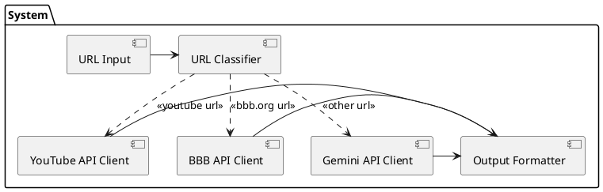

```puml
@startuml
package "System" {

  component "URL Input" as urlInput
  component "URL Classifier" as urlClass
  component "YouTube API Client" as ytClient
  component "BBB API Client" as bbbClient
  component "Gemini API Client" as geminiClient
  component "Output Formatter" as output

  urlInput -right-> urlClass
  urlClass ..> ytClient : <<youtube url>>
  urlClass ..> bbbClient : <<bbb.org url>> 
  urlClass ..> geminiClient : <<other url>>
  ytClient -right-> output
  bbbClient -right-> output
  geminiClient -right-> output
  
}
@enduml
```